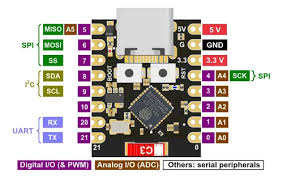

# ESP32-C3 and ESP32-S3 Mini Dual/Triple UART ↔ BLE Bridge


High-throughput dual UART to Bluetooth Low Energy bridge for the **ESP32-C3 Mini**, built with **ESP-IDF + NimBLE**.

Turn an ESP32-C3 Mini into a compact BLE serial bridge for embedded devices, sensors, test equipment, or UART-based protocols.

---

# Overview

Feature:

- Dual independent UART channels over BLE for ESP32C3 - Three independet UART channels for ESP32 S3.  
- Bidirectional bridge:
  - UART → BLE notifications
  - BLE writes → UART
- One GATT service per UART
- MTU-aware packet fragmentation
- Event-driven UART transport
- Designed for high-throughput BLE communication
- Companion Python TCP bridge in `/tools`

---

# Hardware

Tested on:

- ESP32-C3 Mini DEV Board
- ESP32-S3 AI DEV Board
- (Waiting to be tested on) ESP32-S3 Super Mini Dev Board.

Example wiring:

For ESP 32 C3 Mini Dev Board

```text
UART0
TX -> GPIO4
RX -> GPIO5

UART1
TX -> GPIO9
RX -> GPIO10
```
For Esp 32 S3 Dev Boards 

```text
UART0
TX -> GPIO4
RX -> GPIO5

UART1
TX -> GPIO6
RX -> GPIO7

UART2
TX -> GPIO1
RX -> GPIO2
```


Default serial settings:

```text
115200 8N1
```

---

# Board


<p align="center">

</p>

---

# Architecture

```text
                    BLE Central
                        |
         +--------------+---------------+
         |                              |
   UART0 BLE Service               UART1 BLE Service
         |                              |
      UART0                           UART1
         |                              |
   External Device A              External Device B
```

---

# Data Flow

UART to BLE:

Device -> UART RX -> ESP32 -> BLE Notify -> Client

BLE to UART:

Client -> BLE Write -> ESP32 -> UART TX -> Device

Bidirectional bridge:

UART <=====> BLE

---

# GATT Layout

## UART0 Service

Contains:

- RX characteristic (Write)
- TX characteristic (Notify)

---

## UART1 Service

Contains:

- RX characteristic (Write)
- TX characteristic (Notify)

UUIDs defined in:

```text
ble_spp_server.h
```

---

# Build

Requirements

- ESP-IDF 5.x
- NimBLE enabled

Build:

```bash
idf.py set-target esp32c3
idf.py build
idf.py flash monitor
```

---

# Configuration

Adjust pins and UART settings in:

```text
app_main()
ble_spp_uart_init()
```


Default device name:

```text
UART-to-BLE-Bridge
```

# Performance

Implemented:

- MTU-aware chunking
- Event-driven UART tasks
- Connection-aware routing
- BLE notification pipeline

Planned optimizations:

- Add security layers 
- Add light sleep mode interruption 
- 2M PHY tuning - Done. 
- Throughput benchmarking
- Add service for UART baud rate change on runtime - Done. 

Target:

```text
~200 KB/s BLE throughput
```

(under tuned conditions)

---

# Python TCP Bridge

Companion tools:

```text
tools/
```

Provides:

- Auto reconnecting BLE client
- TCP sockets mapped to each UART
- Serial-over-TCP through BLE

See:

[tools/README.md](tools/README.md)


---

# Repository Layout

```text
.
├── main/
├── tools/
├── docs/
└── README.md
```

---

# Roadmap

- [ ] Extended multi-client support
- [ ] Framed packet mode
- [x] Performance tuning
- [x] UART baud rate change in run time

---

# License

MIT